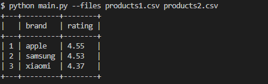
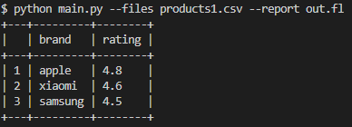
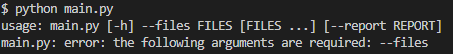
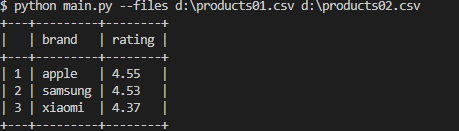
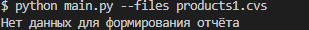

Параметр __--report__ не является обязательным. При его отсутствии имя для файла отчёта берётся равным "_average-rating.txt_"

### Примеры запуска

Опечатка в имени файла

### Добавление нового отчёта
Что бы добавить новый вариант отчёта нужно изменить параметры вызова функции _get_data4report_(csvfiles, __analyzed_col1=1__, __analyzed_col2=3__)

Параметр __analyzed_col1__ указывает на столбец, содержащий сроковые данные для групиировки,

а __analyzed_col2=3__ указывает настолбец, содержащий числовые данные для подсчёта среднего значения.